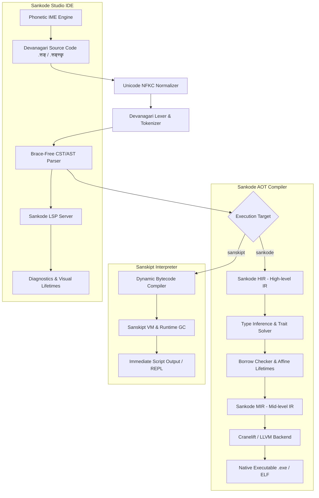

# Sankode & Sanskipt: Language Specification & Implementation Plan
**A Pure Devanagari-Native Systems Programming Language, Memory-Safe Compiler, Scripting Runtime, and Bespoke IDE**

---

## 1. Executive Summary & Vision

**Sankode** (सङ्कोड) is a compiled, strongly typed, memory-safe systems programming language where code, keywords, identifiers, and literals are authored entirely in **Devanagari script**. It eliminates foreign syntactic artifacts such as curly brackets `{ }` and western numerals, replacing them with a structured grammar rooted in classical Sanskrit phonology and Paninian formal conciseness (*lāghava* - लाघव).

### Key Architectural Pillars
1. **Devanagari Orthography**: All source files (`.सङ्` for Sankode, `.सङ्स्कृ` for Sanskipt) are UTF-8 Devanagari texts. Literals use Devanagari numerals (`०`–`९`).
2. **Brace-Free Structural Grammar**: No curly braces (`{ }`). Block scopes and expressions are delimited using unambiguous Sanskrit grammatical markers (e.g., `आरम्भ`...`इति` or sutra-style clause markers with Danda `।` and Double Danda `॥`).
3. **Rust-Equivalent Memory Safety**: Affine type system with explicit Ownership (`स्वामित्व`), Borrowing (`ऋण`), Mutable Borrowing (`विकार्य ऋण`), and Lifetimes (`आयुः`), guaranteeing zero-cost memory safety without a garbage collector.
4. **Dual Runtime Strategy**:
   - **Sankode (`sankode`)**: Ahead-Of-Time (AOT) compiled to native machine code via Cranelift / LLVM.
   - **Sanskipt (`sanskipt`)**: Dynamic, interactive script interpreter and bytecode VM modeled after Python's rapid scripting workflow and high-level ergonomics.
5. **Sankode Studio (Bespoke Minimal IDE)**: A developer environment featuring real-time phonetic transliteration (typing `kriya` seamlessly renders `क्रिया`, `1` renders `१`), Devanagari typography engine, LSP integration, and dual-mode execution.

---

## 2. Orthography, Unicode & Lexical Grammar

### 2.1 Unicode Normalization
All input streams are normalized to **Unicode NFKC (Compatibility Decomposition, followed by Canonical Composition)** to prevent inconsistencies with Devanagari nuktas, conjunct characters, and matras.

- **Valid Character Ranges**:
  - Devanagari Base & Matras: `U+0900` to `U+097F`
  - Devanagari Extended: `U+0980` to `U+09FF`
  - Whitespace: Standard space, tab, newline (`\n`, `\r\n`)

### 2.2 Numerals (संख्या)
All numerical literals in source code must use Devanagari digits:
| Devanagari | Western Equivalent | Decimal Value |
|:---:|:---:|:---:|
| `०` | 0 | 0 |
| `१` | 1 | 1 |
| `२` | 2 | 2 |
| `३` | 3 | 3 |
| `४` | 4 | 4 |
| `५` | 5 | 5 |
| `६` | 6 | 6 |
| `७` | 7 | 7 |
| `८` | 8 | 8 |
| `९` | 9 | 9 |

- **Fractional Separator**: Bindu `.` or Devanagari fraction separator. For example: `३.१४१५९` (3.14159).
- **Number Literals**:
  - `१०२४_पूर्ण६४` (Signed 64-bit integer literal)
  - `३.१४_अंश६४` (64-bit floating point literal)

### 2.3 Punctuation & Delimiters (No `{ }`)
Sankode strictly excludes `{` and `}`:
- **Danda `।` (`U+0964`)**: Statement terminator / separator (similar to `;` in C/Rust).
- **Double Danda `॥` (`U+0965`)**: Section / Top-level declaration / Module terminator.
- **Parentheses `(` `)`**: Only used for mathematical grouping and expression precedence.
- **Square Brackets `[` `]`**: Array indexing and generic type parameters (e.g. `सूची[पूर्ण३२]`).
- **Colons `:` or `->`**: Type annotation indicator (`:`) and return indicator (`->` or `फल`).

---

## 3. The Minimal Keyword System (शब्दसङ्ग्रह)

To maintain clarity and adhere to the principle of *lāghava* (minimality), Sankode defines exactly **20 core keywords**:

| Keyword | Transliteration | Role / Meaning | Equivalent in Rust / Python |
|---|---|---|---|
| `क्रिया` | Kriyā | Function / Procedure definition | `fn` / `def` |
| `मान` | Māna | Immutable variable binding | `let` |
| `विकार्य` | Vikārya | Mutable modifier | `mut` |
| `स्थिर` | Sthira | Compile-time constant | `const` |
| `संरचना` | Saṁracanā | Struct / Product data type | `struct` / `class` |
| `विकल्प` | Vikalpa | Sum type / Enumeration | `enum` |
| `गुण` | Guṇa | Trait / Interface contract | `trait` / `Protocol` |
| `विधान` | Vidhāna | Implementation block | `impl` |
| `यदि` | Yadi | Conditional branch | `if` |
| `अन्यथा` | Anyathā | Fallback branch | `else` |
| `यावत्` | Yāvat | Loop with condition | `while` |
| `प्रत्येक` | Pratyeka | Collection iteration loop | `for ... in` |
| `इति` | Iti | Universal block / clause closure | `end` / `fi` / `}` |
| `प्रति` | Prati | Return statement / Yield value | `return` |
| `भङ्ग` | Bhaṅga | Loop break | `break` |
| `अनुवृत्त`| Anuvṛtta | Loop continue | `continue` |
| `ऋण` | Ṛṇa | Immutable reference / borrow | `&` |
| `चलऋण` | Cala-Ṛṇa | Mutable reference / borrow | `&mut` |
| `सत्यम्` | Satyam | Boolean literal: True | `true` |
| `मिथ्या` | Mithyā | Boolean literal: False | `false` |

---

## 4. Sankode Type System & Memory Model

### 4.1 Primitive Types
- `पूर्ण८`, `पूर्ण१६`, `पूर्ण३२`, `पूर्ण६४` — Signed integers (i8, i16, i32, i64)
- `अपू८`, `अपू१६`, `अपू३२`, `अपू६४` — Unsigned integers (u8, u16, u32, u64)
- `अंश३२`, `अंश६४` — IEEE 754 Floating point numbers (f32, f64)
- `द्वैध` — Boolean (`सत्यम्` or `मिथ्या`)
- `वर्ण` — Unicode scalar character (32-bit char)
- `सूत्र` — Owned UTF-8 Devanagari string buffer (`String`)
- `रिक्त` — Unit type `()`

### 4.2 Affine Memory & Ownership Architecture (स्वामित्व सिद्धान्त)
Sankode implements an affine type system enforced statically at compile time:
1. **Single Owner (`एकल स्वामी`)**: Every resource/heap value in memory has exactly one owner variable.
2. **Move on Assignment (`संक्रमण`)**: Assigning an owned value transfers ownership; the original identifier is invalidated.
3. **Borrowing Rules (`ऋण नियम`)**:
   - Any number of immutable borrows (`ऋण मान`) may coexist simultaneously.
   - **OR** exactly one mutable borrow (`चलऋण मान`) may exist in a given scope.
   - References must never outlive their referent (`आयुः नियम` - Lifetime Rule).
4. **Deterministic Reclamation (`मोक्ष` / Scope Termination)**: When a variable goes out of scope at `इति`, its allocated memory is reclaimed deterministically without pause or GC overhead.

---

## 5. Syntax by Example

### 5.1 Fibonacci Function (Recursion & Match)
```sankode
॥ फलनप्रदर्शनम् ॥

क्रिया फिबोनाची(संख्या: पूर्ण६४) -> पूर्ण६४
    यदि संख्या <= १
        प्रति संख्या।
    इति
    प्रति फिबोनाची(संख्या - १) + फिबोनाची(संख्या - २)।
इति

क्रिया मुख्य() -> रिक्त
    मान परिणाम: पूर्ण६४ = फिबोनाची(१०)।
    मुद्रय("परिणामः = ", परिणाम)।
इति
```

### 5.2 Structs, Methods & Ownership-Based Borrowing
```sankode
॥ बिन्दु संरचना ॥

संरचना बिन्दु
    क्ष: अंश६४।
    य: अंश६४।
इति

विधान बिन्दु
    क्रिया नूतन(क्ष: अंश६४, य: अंश६४) -> बिन्दु
        प्रति बिन्दु(क्ष: क्ष, य: य)।
    इति

    क्रिया स्थानान्तरण(चलऋण स्व, विस्थापन_क्ष: अंश६४, विस्थापन_य: अंश६४) -> रिक्त
        स्व.क्ष = स्व.क्ष + विस्थापन_क्ष।
        स्व.य = स्व.य + विस्थापन_य।
    इति

    क्रिया दूरम्(ऋण स्व, ऋण अन्य: बिन्दु) -> अंश६४
        मान अन्तर_क्ष = स्व.क्ष - अन्य.क्ष।
        मान अन्तर_य = स्व.य - अन्य.य।
        प्रति मूल((अन्तर_क्ष * अन्तर_क्ष) + (अन्तर_य * अन्तर_य))।
    इति
इति

क्रिया मुख्य() -> रिक्त
    विकार्य मान ब१ = बिन्दु.नूतन(०.०, ०.०)।
    मान ब२ = बिन्दु.नूतन(३.०, ४.०)।
    
    ब१.स्थानान्तरण(१.०, १.०)।
    मान अन्तर = ब१.दूरम्(ऋण ब२)।
    
    मुद्रय("दूरता = ", अन्तर)।
इति
```

---

## 6. Sanskipt: The Interactive Dynamic Scripting Layer

While `sankode` is strictly typed and AOT-compiled, **Sanskipt** (`.सङ्स्कृ`) provides a dynamic, Python-like environment for rapid prototyping, data science, scripting, and educational exploration.

### 6.1 Design Philosophy of Sanskipt
- **Python-Like Dynamic Semantics**: Variables do not require static type annotations; types are associated with values at runtime.
- **Same Devanagari Syntax**: Uses identical keywords (`क्रिया`, `यदि`, `इति`, `यावत्`), ensuring code learned in Sanskipt translates directly into Sankode.
- **Reference Counted Garbage Collection (RC + Cycle Collector)**: Automatic memory management for scripts.
- **Interactive REPL (`सङ्वादक`)**:
  ```text
  ॥ सङ्स्कृ सङ्वादकम् (Sanskipt v०.१.०) ॥
  [सहायार्थं 'सहायता()' लिखन्तु]
  
  >>> मान सूची = [१, २, ३, ४, ५]
  >>> सूची.जोड(६)
  >>> मुद्रय(सूची)
  [१, २, ३, ४, ५, ६]
  ```
- **Bytecode Virtual Machine**: Scripts are parsed into an AST, compiled into a register/stack bytecode (`.सङ्खण्ड`), and executed via an optimized portable C/Rust VM.

---

## 7. Sankode Studio: Bespoke Minimal IDE

Writing Devanagari without a dedicated physical keyboard is often cumbersome. **Sankode Studio** resolves this by embedding an intelligent, low-latency input engine directly into the editor.

### 7.1 Key Features of the IDE
1. **Phonetic Transliteration Engine (लिपि-परिवर्तक)**:
   - On-the-fly transliteration from Roman keys (ITRANS / Harvard-Kyoto / Velthuis) into Devanagari.
   - *Example*: Typing `k r i y a <space>` dynamically expands to `क्रिया`.
   - Typing Western digits `0`-`9` automatically converts into `०`-`९` when in code mode.
2. **Typography & Font Engine**:
   - Shipped with pre-configured ligature-supporting open-source Devanagari monospace fonts (e.g., *Sanskrit Text*, *Noto Sans Devanagari*, *Shobhika*).
3. **Integrated Language Server Protocol (LSP - `sankode-lsp`)**:
   - Real-time syntax error markers.
   - Borrow checker visualization: highlighting lifetimes, moved variables, and active borrows in distinct colors.
   - Autocomplete in Devanagari for keywords and symbols.
4. **Dual-Mode Runner**:
   - `F5` / `सञ्चालन`: Instantly runs current script in `sanskipt` VM.
   - `Ctrl+Shift+B` / `सङ्कलन`: Compiles current project with `sankode` into native binary and launches debugger.

---

## 8. Compiler & Toolchain Architecture



---

## 9. Implementation Phases & Roadmap

### Phase 1: Foundation, Grammar & Lexical Engine (Weeks 1–3)
- [ ] Define full formal EBNF grammar for Devanagari tokens, keywords, and Danda-based termination.
- [ ] Implement Rust-based Lexer (`sankode-lexer`) supporting UTF-8 Devanagari characters, combining matras, and Devanagari numerals (`०`–`९`).
- [ ] Build Unicode normalization layer (NFKC) and source span tracker for rich Devanagari diagnostics.

### Phase 2: AST & Brace-Free Parser (Weeks 4–6)
- [ ] Implement recursive descent parser (`sankode-parser`) with Pratt expression parsing.
- [ ] Implement indentation/keyword-bounded block parsing (`आरम्भ` ... `इति`, `यदि` ... `इति`, `क्रिया` ... `इति`).
- [ ] Comprehensive test suite of syntax trees for expressions, control flows, and declarations.

### Phase 3: Semantic Analysis & The Affine Borrow Checker (Weeks 7–10)
- [ ] Symbol resolution and type checking (`sankode-types`).
- [ ] Ownership tracking: move semantics, use-after-move prevention.
- [ ] Borrow Checker implementation (`sankode-borrowck`): Non-lexical lifetimes (NLL), reference validity checks, aliasing XOR mutability guarantees.

### Phase 4: Code Generation & Native Compiler CLI (Weeks 11–13)
- [ ] Implement Cranelift or LLVM IR emission (`sankode-codegen`).
- [ ] Generate native binaries on Windows (`.exe`), Linux, and macOS.
- [ ] Implement standard library primitives (`sankode-stdlib`): console I/O (`मुद्रय`), math (`गणित`), strings (`सूत्र`).

### Phase 5: Sanskipt Dynamic VM & REPL (Weeks 14–16)
- [ ] Build `sanskipt` bytecode compiler and stack-based VM (`sanskipt-vm`).
- [ ] Dynamic object model with reference counting.
- [ ] Interactive REPL with syntax colorization, command history, and bilingual error messaging.

### Phase 6: Sankode Studio Minimal IDE (Weeks 17–20)
- [ ] Build lightweight desktop IDE using Tauri + Rust + Web frontend (or modern egui/native UI).
- [ ] Implement phonetic transliteration engine (English keyboard -> Devanagari).
- [ ] Integrate Sankode LSP (`sankode-lsp`) for autocomplete, diagnostic squiggles, and compile/run controls.
- [ ] Package cross-platform installer.

---

## 10. Verification & Quality Assurance Strategy

1. **Orthography & Lexer Tests**: Verify exact handling of conjuncts, halant (`्`), anusvara (`ं`), and numerals `०` through `९`.
2. **Grammar Conformance Suite**: Ensure all standard programming patterns compile without `{ }`.
3. **Borrow Checker Soundness Test Suite**:
   - Reject use-after-move.
   - Reject simultaneous mutable and immutable borrows.
   - Reject returning references to stack-allocated variables.
4. **Execution Parity Tests**: Verify identical numerical and algorithmic results between `sankode` compiled binary and `sanskipt` interpreter execution.
5. **IDE Usability Tests**: Validate typing velocity and transliteration accuracy for developers using standard QWERTY keyboards.
